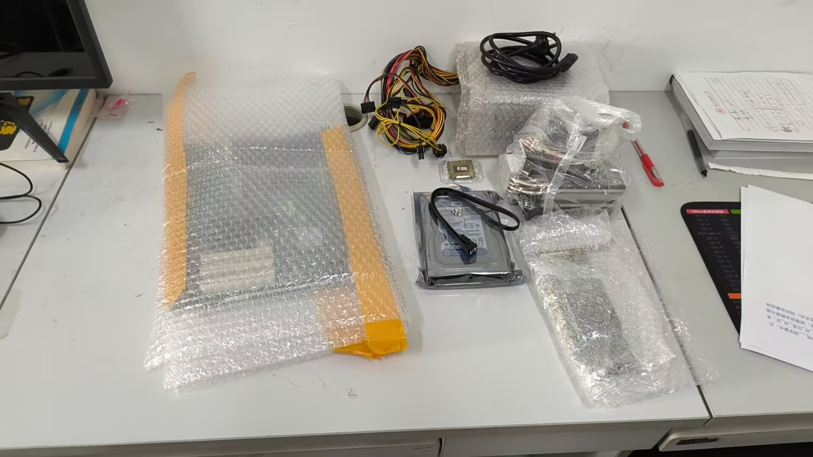
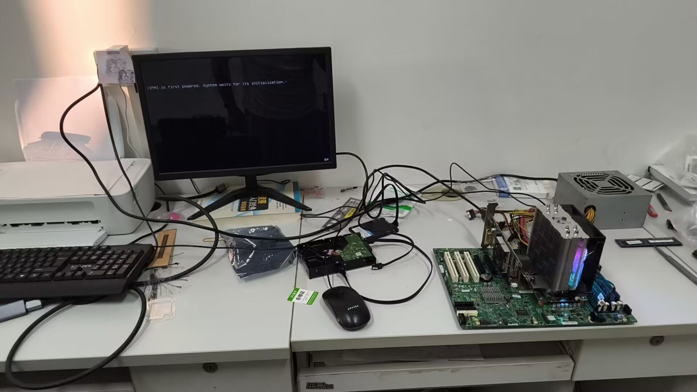
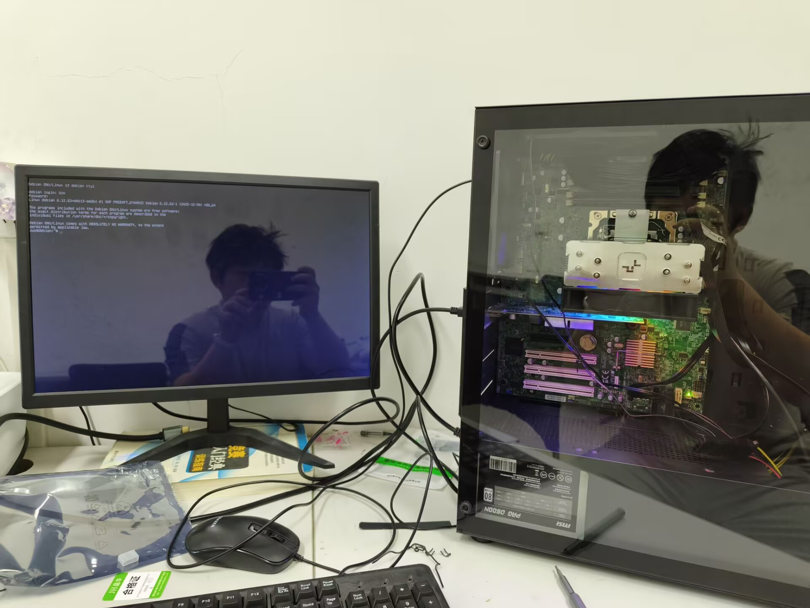

+++
date = '2026-03-28T23:44:35+08:00'
draft = true
title = '搭服务器'

+++

2026年2月，我考完研回家呆着，机缘巧合下拿到了一批淘汰的服务器内存条。拥有一台服务器来支撑我的各种奇妙想法一直是我的梦想之一，于是3月初我带着内存条回到了学校。

我记得在我刚上大学的时候，有很多人在百度贴吧询问电脑配置，不过现在容易多了，我通过 ChatGPT 轻松的得到了一套服务器配置：

| 配件     | 型号                                            | 价格          |
| :------- | ----------------------------------------------- | ------------- |
| 主板     | 超微X9SCA-F                                     | 闲鱼 145元    |
| CPU      | Intel® Xeon® Processor E3-1230 v2               | 淘宝 65元     |
| RAM      | 4GB ECC DDR3 * 4                                | 0元购         |
| GPU      | 便宜亮机显卡                                    | 闲鱼 36元     |
| SSD      | 忆捷 120GB SATA                                 | 京东 149元    |
| HDD      | 西数蓝盘 500GB SATA（像翻新的，不知道能用多久） | 闲鱼 57元     |
| 散热器   | 九州风神玄冰400                                 | 闲鱼 30元     |
| 机箱风扇 | 12cm风扇 * 2                                    | 闲鱼 8.4元    |
| 机箱     | 长城 本色K13                                    | 京东 94.9元   |
| 电源     | 网吧拆机二手微星 额定500W                       | 闲鱼 59元     |
|          |                                                 | 总计：644.3元 |

3月4号，所有配件都到了。

  
  
图 1：我的电脑配件们

虽说没有实际安装过任何一台电脑主机，但我多次拆开我的笔记本和天天观看装机视频，所以很快便轻松点亮。在操作系统方面，我选择了Debian 13 (trixie)，这是因为我曾在我的二手轻薄本上安装Debian 12，对这个系统较有好感。~~亲爱的女朋友最爱Arch Linux，不过虽然我也很爱折腾电脑，但也远远没到愿意折腾Arch的地步。~~

  
  
图 2：成功点亮

本以为大功告成了，结果却发现我一开始购入的机箱塞不下这块ATX主板，原来是买成了mATX……急于装入机箱打包带走的我随即在闲鱼联系了一位同城自提的大机箱，没想到的是，在我骑小电驴将机箱拿回来后，居然还是不够大！不得已只能在京东上买了一个全新的、明明白白写着支持ATX主板的机箱。至于没用上的两个机箱，全都捐赠给学院的电脑维修志愿服务队了。

机箱到了后又发现主板供电线不够长，于是又购入24pin延长线……就这样反复折腾，终于在3月9号，一切大功告成！

  
  
图 3：装入机箱

将电脑搬到我的住处，我跟着GPT开始学习运行一台服务器所需要的知识。不得不承认，GPT操作电脑的能力远远大于我，我所能干的只有叫他讲的慢一点，跟我讲清楚每个指令起到的作用。在反复对话中，我慢慢开始理清楚文件管理和网络结构，这些知识我虽在备考408时学到过，但真的让我来维护服务器，感觉完全无从下手。

说到408，我的考研感觉还是失败了，所以也没准备复试，日子一天天的溜走，折腾这台小服务器是我唯一有兴趣做的事了。建个人博客、本地git仓库、NAS？感觉能做的事情还很多。
